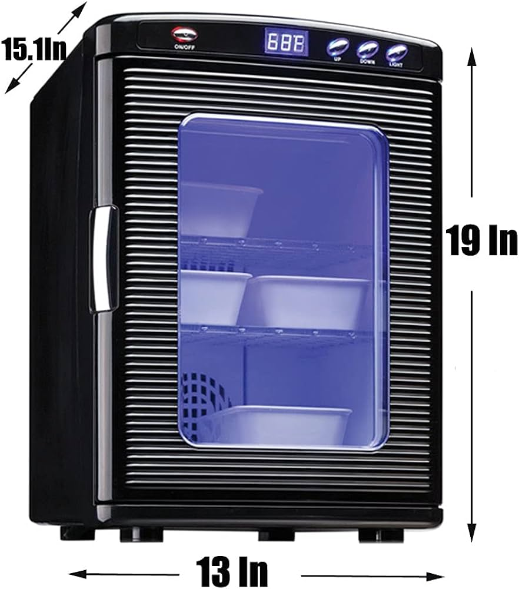

# Programmable Incubator for Protein Expression

## Summary

The Programmable Incubator for Protein Expression project is developing a control module that can be added to a commercially available incubator that allows programming of temperature profiles over time, currently using a WiFi interface that allows user to connect via a phone or computer without the need for internet access.

The primary use case is controlling temperature during overnight autoinduction of recombinant proteins in _Escherichia coli_.

## Background

Open Bioeconomy Lab developed a protocol for expressing recombinant proteins in _E. coli_ on autoinduction agar in petri dishes. This solid state bioreactor approach removes the need for shaking incubators and high-volume centrifuges from the protein production process.

Low-cost peltier controlled incubator (often sold commercially as an egg incubator or a beer fridge) offer an affordable solution for incubation of protein expression cultures at common growth temperatures e.g. 37 C. 

They can also be integrated with DIY orbital shakers to provide a small-footprint, adaptable package for protein expression. However, often protein expression is maximised when temperatures are dropped following induction (e.g. to 18 C or even 11 C), in order to reduce growth and allow for slower folding and maturation of the protein. If the user is inducing the culture then they can manually adjust the temperature but there are contexts in which it would be convenient to have programmable control. These include:

 - Autoinduction, where induction occurs as a result of metabolism or bacterial growth, usually overnight because this is a convenient time to incubate the culture.
 - Where automated induction using heat, light or chemical addition to the culture is possible (this is especially useful when coupled with measurement of cell growth and protein expression using sensors)

It is therefore advantageous to be able to programme temperature profiles over time and leave the incubator to implement these autonomously (or in response to sensor input).

The Programmable Incubator for Protein Expression project is developing a control module that can be added to the commercially available incubator that allows programming of temperature profiles, currently using a WiFi interface that allows user to connect via a phone or computer without the need for internet access.

